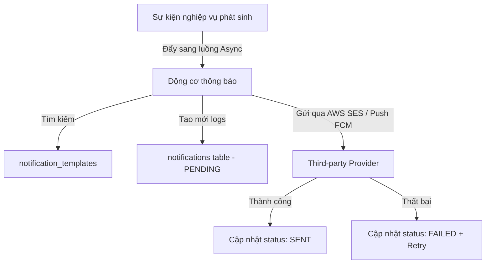

# BUSINESS_FLOW.md - THIẾT KẾ CÁC LUỒNG NGHIỆP VỤ TỔNG THỂ
## Dự án: Hệ thống Quản lý Bảo dưỡng Xe Điện (Project_01)
---

> [!IMPORTANT]
> **Triết lý thiết kế Luồng Nghiệp Vụ:** 
> * **State-Driven Workflow:** Tất cả các luồng nghiệp vụ lớn đều được điều khiển bởi Máy Trạng Thái (State Machine / Status Lifecycle) cực kỳ chặt chẽ nhằm tránh xung đột dữ liệu.
> * **Event-Driven Integration:** Sự chuyển đổi trạng thái ở Module này sẽ kích hoạt (Trigger) các sự kiện ở các Module khác (Realtime, Notification, Inventory, Billing) một cách tự động, không đồng bộ (Async) ở những phần không ảnh hưởng trực tiếp đến Transaction chính.
> * **Fail-safe Design:** Định nghĩa rõ ràng kịch bản lỗi (Error Scenarios) và điểm khôi phục (Rollback Points) cho từng giao dịch.

---

## 1. Authentication Flow (Luồng Đăng ký & Xác thực)

### Sơ đồ trạng thái người dùng (User Status Lifecycle):
```
[Tạo mới] ───> Trạng thái: ACTIVE ───(Bị Admin khóa)───> Trạng thái: BLOCKED
```

### Các bước thực hiện chi tiết (Step-by-Step):
1. **Đăng ký tài khoản (Customer):**
   * Khách hàng gửi thông tin đăng ký (`username`, `password`, `email`, `phone`, `full_name`).
   * Hệ thống validate định dạng và kiểm tra trùng lặp `username`, `email`, `phone` trong database (Bảng `users` với chỉ mục `UNIQUE` kết hợp `deleted_at`).
   * Mã hóa mật khẩu bằng **BCrypt**.
   * Lưu User mới vào bảng `users` với trạng thái `ACTIVE`, gán role `ROLE_CUSTOMER` vào bảng `user_roles`.
   * Gửi Email chào mừng chào đón khách hàng (Kích hoạt Async Notification).
2. **Đăng nhập (Tất cả Actors):**
   * Client gửi thông tin đăng nhập (`username`, `password`).
   * Hệ thống truy vấn thông tin User từ Database.
   * *Kiểm tra điều kiện:* Nếu User không tồn tại hoặc ở trạng thái `BLOCKED` -> Trả về lỗi `Unauthorized (401)`.
   * So khớp mật khẩu đã nhập với hash lưu trong DB bằng BCrypt.
   * Nếu khớp: Sinh **JWT Token** chứa `userId`, `username`, `roles` và hạn hết hạn (Expiration Time).
   * Trả về JWT Token cùng thông tin User cơ bản.

### Trách nhiệm các Actor (Actor Responsibilities):
* **Customer / Staff:** Cung cấp thông tin đăng nhập chính xác.
* **Hệ thống (Backend):** Thực hiện mã hóa mật khẩu, kiểm tra trạng thái và sinh Token an toàn.

### Kịch bản lỗi và xử lý (Error & Rollback):
* **Trùng thông tin đăng ký:** Hệ thống ném ra `DuplicateResourceException` và hủy transaction tạo mới.
* **Sai mật khẩu quá 5 lần:** Hệ thống ghi nhận số lần đăng nhập sai tạm thời vào cache (Redis), nếu vượt ngưỡng sẽ khóa tài khoản chuyển sang `BLOCKED` trong 15 phút.

---

## 2. Booking Flow (Luồng Đặt lịch hẹn)

### Sơ đồ trạng thái Lịch hẹn (Booking Status Lifecycle):
```
[Tạo mới] ───> Trạng thái: PENDING ───(SA xác nhận)───> Trạng thái: CONFIRMED
  │                                                        │
  └──────────────────(Khách hàng hủy / SA từ chối)───────┼───> Trạng thái: CANCELLED
                                                           │
                                                      (Khách mang xe đến)
                                                           │
                                                           ▼
                                                 Trạng thái: IN_SERVICE
```

### Các bước thực hiện chi tiết (Step-by-Step):
1. **Đặt lịch hẹn:**
   * Customer gửi yêu cầu đặt lịch gồm: Ngày giờ (`appointment_time`), loại dịch vụ (`service_type`), biển số xe (`license_plate`), ghi chú lỗi.
   * **Slot Validation (Transaction Boundary):** Hệ thống kiểm tra trùng lịch (ví dụ: Mỗi khung giờ tối đa tiếp nhận 5 xe). Nếu vượt quá -> Yêu cầu khách chọn khung giờ khác.
   * Lưu thông tin vào bảng `bookings` với trạng thái ban đầu là `PENDING`.
2. **Xác nhận/Hủy lịch:**
   * Service Advisor (SA) duyệt danh sách đặt lịch trên Web Dashboard.
   * **SA Duyệt:** Chuyển trạng thái lịch hẹn thành `CONFIRMED`. Hệ thống tự động gửi **Push Notification / Email** xác nhận tới Khách hàng.
   * **SA Từ chối / Khách hàng Hủy:** Chuyển trạng thái sang `CANCELLED` (Cung cấp lý do hủy). *Lưu ý:* Khách hàng chỉ được phép hủy trước giờ hẹn 2 tiếng.

### Kịch bản lỗi và xử lý (Error & Rollback):
* **Lỗi trùng slot giờ chót:** Khi hai khách hàng cùng ấn đặt slot cuối cùng tại một thời điểm. 
  * *Giải pháp:* Sử dụng Transaction với Pessimistic Lock khi kiểm tra và tăng số lượng đếm slot trong bảng quản lý khung giờ, đảm bảo người ấn sau sẽ bị báo slot đầy và rollback transaction đặt lịch.

---

## 3. Technician Assignment Flow (Luồng phân công kỹ thuật viên)

### Các bước thực hiện chi tiết (Step-by-Step):
1. **Khách mang xe đến gara:**
   * SA tiếp nhận xe, quét OBD-II ghi nhận lỗi, tạo phiếu tiếp nhận `vehicle_receptions`.
   * Trạng thái Lịch hẹn `bookings` tự động chuyển sang `IN_SERVICE`.
2. **Phân công kỹ thuật viên (Technician Assignment):**
   * Hệ thống hiển thị danh sách các Kỹ thuật viên (Technician) đang rảnh việc hoặc có kỹ năng phù hợp (ví dụ: Thợ điện cao áp chuyên sửa pin).
   * SA chọn thợ và bấm **Phân công**.
   * Hệ thống tạo mới Lệnh sửa chữa `repair_orders` với trạng thái `IN_PROGRESS`, gán `assigned_technician_id` bằng ID thợ vừa chọn.
   * **Realtime Update:** Hệ thống gửi tín hiệu realtime qua WebSocket thông báo tới Mobile App của thợ được phân công. Đồng thời gửi Push Notification báo trạng thái xe bắt đầu bảo dưỡng cho Khách hàng.

---

## 4. Maintenance & Checklist Workflow (Luồng Bảo dưỡng & Tích chọn Checklist)

### Sơ đồ trạng thái Lệnh sửa chữa (Repair Order Status Lifecycle):
```
[Tạo mới] ───> Trạng thái: IN_PROGRESS ───(Thợ báo xong)───> Trạng thái: READY_FOR_QC
                                                                  │
                                            ┌─────────────────────┴──────(SA chạy thử xe)
                                            ▼
                                   Trạng thái: QC_PASSED ───(Thanh toán)───> Trạng thái: COMPLETED
```

### Sơ đồ trạng thái kết quả từng mục Checklist (Checklist Item Status Lifecycle):
```
[Khởi tạo] ───> Trạng thái: PENDING ───┬───(Đo đạc đạt)───────────────> Trạng thái: PASS
                                      └───(Lỗi / Đề xuất thay thế)───> Trạng thái: FAIL
```

### Các bước thực hiện chi tiết (Step-by-Step):
1. **Bắt đầu bảo dưỡng:**
   * Thợ nhận việc trên App di động, bấm **Bắt đầu làm**. Hệ thống ghi nhận thời gian `started_at` vào `repair_orders`.
   * Hệ thống sao chép danh sách các mục kiểm tra từ `checklist_item_templates` tương ứng với gói dịch vụ vào bảng `maintenance_checklist_items` với trạng thái ban đầu là `PENDING`.
2. **Thực hiện checklist:**
   * Thợ kiểm tra từng mục kỹ thuật trên xe thực tế.
   * **Mục đạt:** Thợ tích chọn `PASS`.
   * **Mục lỗi/hỏng:** Thợ tích chọn `FAIL`, ghi nhận thông số thực tế vào cột `notes`. Nếu bước kiểm tra yêu cầu bằng chứng (ví dụ: Đo điện áp cách điện), thợ bắt buộc phải chụp ảnh.
     * *Luồng upload bằng chứng:* App di động xin Pre-signed URL từ Server -> Upload ảnh trực tiếp lên AWS S3 -> Lưu URL ảnh vào cột `evidence_url`.
3. **Báo cáo hoàn thành & QC:**
   * Khi tất cả các mục checklist đã chuyển trạng thái từ `PENDING` sang `PASS` hoặc `FAIL` (không còn mục pending). Thợ bấm **Hoàn thành sửa chữa**.
   * Trạng thái Lệnh sửa chữa chuyển sang `READY_FOR_QC`.
   * SA nhận xe, tiến hành chạy thử và đo kiểm độc lập các tiêu chí an toàn điện cao áp.
   * SA duyệt **QC Đạt**: Chuyển trạng thái `repair_orders` sang `QC_PASSED`. Hệ thống phát sinh thông báo gửi hóa đơn cho khách.

### Ràng buộc nghiệp vụ quan trọng (Business Rules):
* Không cho phép thợ bấm Hoàn thành bảo dưỡng nếu còn bất kỳ hạng mục checklist nào ở trạng thái `PENDING`. Hệ thống sẽ ném lỗi `ChecklistPendingException` khi gọi API kết thúc.

---

## 5. Inventory & Spare Parts Workflow (Luồng yêu cầu linh kiện & Trừ kho)

Đây là luồng nghiệp vụ có **độ phức tạp cao nhất**, yêu cầu tính nhất quán dữ liệu tuyệt đối giữa thợ sửa xe và kho hàng.

### Sơ đồ vòng đời Trừ kho linh kiện:
```
[Thợ khám xe]                               [Khách duyệt]                    [SA Giao xe]
Đề xuất linh kiện ───(Lock tồn kho)───> Số lượng tạm giữ ───(Quyết toán)───> Trừ kho vĩnh viễn
                                            (Allocated)                     (Deducted)
```

### Các bước thực hiện chi tiết (Step-by-Step):
1. **Đề xuất thay linh kiện:**
   * Trong quá trình làm checklist, thợ phát hiện linh kiện X hỏng, tích chọn `FAIL` ở mục checklist đó và chọn **Đề xuất thay thế linh kiện**.
   * Hệ thống gửi yêu cầu lên Service Kho.
2. **Kiểm tra tồn kho & Khóa tạm thời (Inventory Allocation - Transaction Boundary):**
   * **Database Transaction:** Service Kho mở transaction, dùng **Pessimistic Locking (`SELECT ... FOR UPDATE`)** trên dòng linh kiện trong bảng `spare_parts`.
   * Hệ thống kiểm tra số lượng tồn kho `stock_quantity`.
     * **Nếu thiếu:** Trả về lỗi `OutOfStockException`. Transaction rollback. Hệ thống chuyển trạng thái Lệnh sửa chữa sang `WAITING_FOR_PARTS` và bắn thông báo cho SA liên hệ nhà cung cấp.
     * **Nếu đủ:** Giảm trừ số lượng thực trong `stock_quantity`, chuyển số lượng linh kiện này vào trạng thái khóa tạm thời gắn với Lệnh sửa chữa. 
   * Ghi log lịch sử thay đổi vào bảng `inventory_transactions` với kiểu `EXPORT_REPAIR` và trạng thái tạm giữ.
3. **Quyết toán trừ kho vĩnh viễn:**
   * Khi xe hoàn tất toàn bộ quy trình sửa chữa và hóa đơn đã được thanh toán (`PAID`). 
   * Hệ thống chính thức xóa trạng thái tạm giữ, xác nhận số lượng linh kiện đã thực tế tiêu thụ vĩnh viễn.

---

## 6. Invoice & Billing Workflow (Luồng Hóa đơn & Quyết toán tài chính)

### Các bước thực hiện chi tiết (Step-by-Step):
1. **Sinh hóa đơn tự động (Invoice Generation Timing):**
   * **Thời điểm kích hoạt:** Ngay sau khi SA xác nhận trạng thái Lệnh sửa chữa là `QC_PASSED` (xe đã chạy thử đạt yêu cầu).
   * **Transaction Boundary:**
     * Hệ thống tổng hợp toàn bộ tiền công dịch vụ (từ gói dịch vụ tiếp nhận ban đầu) + tiền linh kiện thực tế đã thay thế (được khách hàng approve trong bản báo giá).
     * Áp dụng mã giảm giá / khuyến mãi (nếu có).
     * Tính thuế VAT (10%).
     * Sinh bản ghi hóa đơn trong bảng `invoices` với mã số duy nhất `invoice_number` và trạng thái ban đầu là `UNPAID`.
2. **Thanh toán & Quyết toán:**
   * SA hiển thị hóa đơn cho khách. Khách hàng thực hiện thanh toán (tiền mặt, chuyển khoản hoặc quét mã trên app).
   * SA nhận tiền thành công, bấm **Xác nhận thanh toán** trên Web Dashboard.
   * **Database Transaction:**
     * Cập nhật trạng thái `invoices` thành `PAID`, cập nhật thời gian thanh toán `paid_at`.
     * Chuyển trạng thái Lệnh sửa chữa `repair_orders` thành `COMPLETED`.
     * Kích hoạt cơ chế trừ kho vĩnh viễn các linh kiện tạm giữ.
     * Hệ thống gửi hóa đơn điện tử (PDF) qua Email cho Khách hàng.

---

## 7. Notification Workflow (Luồng động cơ thông báo)

Để đảm bảo không bỏ sót thông tin quan trọng gửi tới người dùng, động cơ thông báo được thiết kế chạy **không đồng bộ (Async)** thông qua các sự kiện kích hoạt (Event-driven).



### Các thời điểm kích hoạt thông báo cốt lõi (Notification Timing):
1. **Đặt lịch thành công:** Ngay sau khi bản ghi `bookings` được lưu ở trạng thái `PENDING` (Gửi Email chào mừng + xác nhận lịch chờ duyệt).
2. **Lịch hẹn được duyệt:** Ngay khi `bookings` chuyển sang `CONFIRMED` (Gửi Push Notification nhắc khách mang xe đúng hẹn).
3. **Báo giá cần duyệt:** Ngay khi SA tạo xong bản báo giá `quotations` (Gửi Push báo khách xem chi tiết chi phí thay phụ tùng).
4. **Xe sửa xong:** Ngay khi lệnh sửa chữa chuyển sang `QC_PASSED` (Báo khách đến gara nhận xe và xem hóa đơn).
5. **Đăng nhập thiết bị lạ:** Bắn cảnh báo tức thì khi phát hiện IP đăng nhập bất thường.

---

## 8. Realtime Chat Workflow (Luồng giao tiếp thời gian thực)

Hạ tầng WebSocket phục vụ kết nối thời gian thực giữa Khách hàng (App di động) và Cố vấn dịch vụ (Web Portal).

### Các bước thực hiện chi tiết (Step-by-Step):
1. **Khởi tạo phòng chat (Room Generation):**
   * Khi khách hàng bấm **Trò chuyện với Cố vấn**.
   * Hệ thống kiểm tra xem đã tồn tại phòng chat hoạt động giữa `customer_id` này và gara chưa. Nếu chưa -> Sinh mới mã phòng chat độc nhất `room_id`.
2. **Truyền nhận tin nhắn Realtime:**
   * Client thiết lập kết nối WebSocket tới server Spring Boot tại endpoint `/ws/chat`.
   * Khi khách hàng gửi tin nhắn: 
     * Tin nhắn được đẩy vào WebSocket channel tương ứng với `room_id`.
     * Server nhận tin nhắn, mở Transaction lưu tin nhắn vào bảng `chat_messages`.
     * Server phát tin nhắn realtime tới Client của Cố vấn dịch vụ đang subscribe phòng chat đó trên Web Dashboard.
3. **Xử lý ngoại tuyến (Offline Handling):**
   * Nếu Cố vấn dịch vụ hoặc Khách hàng đang không trực tuyến (ngắt kết nối WebSocket).
   * Hệ thống sẽ tự động chuyển đổi tin nhắn thành một **Push Notification** gửi tới thiết bị di động của người nhận sau 10 giây không có phản hồi đọc tin nhắn.

---

## 9. AI Recommendation Workflow (Luồng phân tích & Đề xuất AI)

Luồng phân tích thông minh của AI được thiết kế chạy định kỳ (Batch Job) hoặc kích hoạt thủ công, hoàn toàn tách biệt khỏi luồng xử lý Online để tối ưu hiệu năng Database.

### Các bước thực hiện chi tiết (Step-by-Step):
1. **Thu thập dữ liệu:**
   * Hệ thống thu thập dữ liệu lịch sử sửa chữa của xe, số km đã đi (`odometer`), các hạng mục checklist `FAIL` trước đó và dữ liệu chẩn đoán OBD-II lúc tiếp nhận.
2. **Kích hoạt xử lý AI:**
   * Tác vụ nền (Background Job) gửi gói dữ liệu ẩn danh qua AWS Lambda hoặc gọi API của mô hình AI.
3. **Lưu trữ & Trưng bày Đề xuất:**
   * AI phân tích và trả về khuyến nghị: "Pin của xe này có hiện tượng lệch áp ở cell số 12, đề xuất kiểm tra chuyên sâu sau 3,000 km nữa".
   * Hệ thống lưu kết quả phân tích vào bảng `ai_recommendations` dưới dạng JSON payload.
   * Khi Khách hàng mở ứng dụng, hệ thống gọi API đọc dữ liệu khuyến nghị này hiển thị trực quan lên màn hình chính.

---

## 10. Bảng tổng hợp ranh giới Transaction nghiệp vụ của MVP Phase 1

Để hỗ trợ lập trình viên xây dựng mã nguồn chính xác tuyệt đối ngay từ đầu, dưới đây là ranh giới `@Transactional` cần áp dụng cho lớp Service:

| Tên Service Method | Transaction Boundary | Các bảng bị ảnh hưởng | Hành động khi xảy ra lỗi |
| :--- | :--- | :--- | :--- |
| `registerCustomer()` | Bắt đầu Transaction mới | `users`, `user_roles` | Rollback toàn bộ, ném lỗi trùng lặp dữ liệu, không tạo user. |
| `createBooking()` | Bắt đầu Transaction mới | `bookings` | Rollback nếu trùng slot giờ chót. |
| `createVehicleReception()`| Bắt đầu Transaction mới | `vehicle_receptions`, `repair_orders`, `bookings` | Hủy tạo phiếu và RO nếu không cập nhật được trạng thái lịch hẹn. |
| `submitChecklistItem()` | Bắt đầu Transaction mới | `maintenance_checklist_items` | Hủy cập nhật kết quả bước nếu lưu ảnh bằng chứng thất bại. |
| `allocateSpareParts()` | Bắt đầu Transaction mới (Pessimistic Lock) | `spare_parts`, `inventory_transactions` | Rollback số lượng kho nếu phát hiện thiếu hàng (ngăn chặn âm kho). |
| `confirmPayment()` | Bắt đầu Transaction mới | `invoices`, `repair_orders`, `spare_parts` | Rollback toàn bộ hóa đơn nếu cập nhật trạng thái RO thất bại, giữ nguyên số lượng tạm kho. |

---

> [!TIP]
> **Tài liệu Business Flow tổng thể đã hoàn thành!**
> 
> Bản thiết kế chi tiết này đã được lưu trữ tại [BUSINESS_FLOW.md](file:///Users/dev.trungnhan/.gemini/antigravity/brain/44940b1d-846c-4719-bf4a-9547dc788c17/BUSINESS_FLOW.md).
> 
> Hãy xem xét toàn bộ các luồng nghiệp vụ trên. Nếu bạn thấy hoàn toàn hợp lý và đồng ý triển khai, hãy gõ **"accept"** để chúng ta chính thức bước vào giai đoạn **Tạo Database và viết mã nguồn dự án**!
