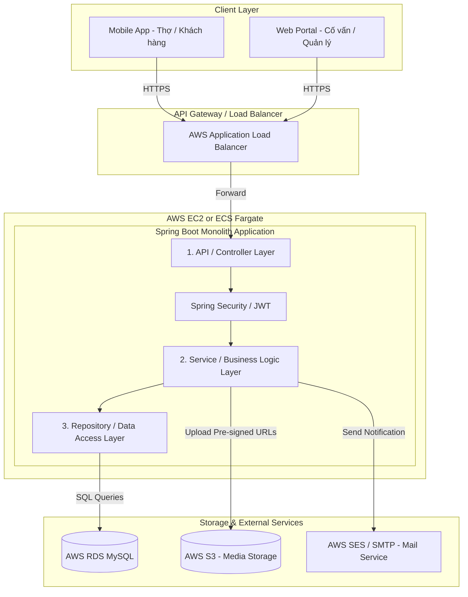
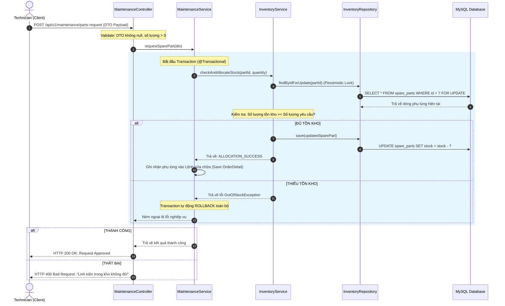

# SYSTEM_ARCHITECTURE.md - KIẾN TRÚC HỆ THỐNG
## Dự án: Hệ thống Quản lý Bảo dưỡng Xe Điện (Project_01)
---

> [!IMPORTANT]
> **Mục tiêu thiết kế:** Xây dựng hệ thống Monolithic phân lớp (Layered Monolith) tinh gọn cho giai đoạn MVP, đảm bảo mã nguồn cực kỳ trong sáng (Clean Code), dễ hiểu cho lập trình viên mới, dễ bảo trì và **sẵn sàng dịch chuyển sang kiến trúc Microservices** trong tương lai mà không cần đập đi xây lại database hay logic cốt lõi.

---

## 1. Sơ đồ kiến trúc tổng quan (Initial Monolithic Architecture)

Hệ thống được thiết kế theo mô hình Monolithic tập trung nhưng sẵn sàng tích hợp các dịch vụ đám mây AWS để tối ưu hóa hiệu năng và chi phí.



---

## 2. Cấu trúc Module Nghiệp vụ (Module Structure & Boundaries)

Để đảm bảo tính độc lập và khả năng migrate sang Microservices dễ dàng, Monolith sẽ được phân ranh giới (Bounded Context) rõ ràng. Các module không được liên kết trực tiếp cấp Database (không map Hibernate Entity chéo), mà giao tiếp qua **Service Interfaces**.

```
[Module Auth & User] 
       │
       ├───────> [Module Booking]
       │             │
       │             ▼
       ├───────> [Module Vehicle Reception & Repair Order]
       │             │
       │             ▼
       ├───────> [Module Maintenance & Checklist] ───> [Module Inventory & Parts]
       │             │
       │             ▼
       └───────> [Module Invoicing & Payment]
```

### Quy tắc biên giới (Boundary Rules):
* **No Direct DB Joins:** Không thực hiện câu lệnh SQL Join bảng chéo giữa các Module khác nhau. Ví dụ: Bảng `Invoice` của module Billing không được join với bảng `SparePart` của module Inventory. Tầng Service của Billing sẽ gọi Service của Inventory qua Interface để lấy thông tin.
* **Reference by ID only:** Trong Entity JPA, các module tham chiếu chéo chỉ sử dụng ID (ví dụ: `private Long customerId`) thay vì sử dụng annotation `@ManyToOne Customer customer`.

---

## 3. Trách nhiệm các lớp kiến trúc (Layer Responsibilities)

Hệ thống tuân thủ nghiêm ngặt mô hình kiến trúc phân lớp chuẩn của Spring Boot:

```
┌─────────────────────────────────────────────────────────────┐
│                 Controller Layer (REST API)                 │
│  - Tiếp nhận HTTP Request                                   │
│  - Validate dữ liệu đầu vào (@Valid / @NotNull)             │
│  - Chuyển đổi DTO <-> Entity (qua MapStruct)                │
└──────────────────────────────┬──────────────────────────────┘
                               │
                               ▼
┌─────────────────────────────────────────────────────────────┐
│                 Service Layer (Business)                    │
│  - Xử lý Business Logic, tính toán chi phí                  │
│  - Đảm bảo tính Transactional (@Transactional)              │
│  - Phối hợp dữ liệu chéo giữa các Module                    │
└──────────────────────────────┬──────────────────────────────┘
                               │
                               ▼
┌─────────────────────────────────────────────────────────────┐
│                Repository Layer (Data Access)               │
│  - Giao tiếp với MySQL Database qua Spring Data JPA         │
│  - Tối ưu hóa truy vấn bằng Query Method / JPQL             │
└─────────────────────────────────────────────────────────────┘
```

### Chi tiết vai trò & Ràng buộc:

| Lớp (Layer) | Trách nhiệm chính | Quy tắc nghiêm ngặt (Strict Rules) |
| :--- | :--- | :--- |
| **Controller** | Đón nhận request, định tuyến URL, chuyển đổi kiểu dữ liệu, bắt lỗi sơ bộ qua Validation API. | • Tuyệt đối không viết logic nghiệp vụ tại đây.<br>• Không gọi trực tiếp Repository.<br>• Chỉ nhận và trả về DTO, không trả về Entity. |
| **Service** | Xử lý nghiệp vụ chính của hệ thống. Kiểm soát luồng chạy dữ liệu, quản trị giao dịch (Database Transaction). | • Nơi duy nhất được phép chứa business logic.<br>• Phải sử dụng Constructor Injection để tiêm các dependencies. |
| **Repository**| Thực hiện truy vấn dữ liệu từ MySQL DB. | • Không chứa logic nghiệp vụ.<br>• Hạn chế tối đa việc viết câu lệnh SQL thuần (Native SQL), ưu tiên JPQL/HQL. |
| **Entity** | Ánh xạ trực tiếp cấu trúc bảng cơ sở dữ liệu. | • Không chứa business logic phức tạp.<br>• Bắt buộc có các trường audit (`created_at`, `updated_at`, `deleted_flag`). |
| **DTO** | Trung chuyển dữ liệu giữa Client và Server. | • Không chứa logic, chỉ chứa các trường dữ liệu phẳng (flat fields) và validation annotations (`@NotBlank`, `@Size`). |

---

## 4. Luồng xử lý nghiệp vụ mẫu (Communication Flow)

Dưới đây là biểu đồ mô tả luồng giao tiếp giữa các Layer khi thực hiện nghiệp vụ **Kỹ thuật viên yêu cầu phụ tùng thay thế và hệ thống tự động trừ kho**:



---

## 5. Cấu trúc thư mục dự án (Package Structure)

Dự án sẽ được tổ chức theo **Package by Feature** kết hợp với **Layered Architecture** bên trong mỗi feature. Cấu trúc này giúp lập trình viên cực kỳ dễ định vị file cần sửa và dễ bóc tách module khi chuyển lên Microservices sau này.

```bash
src/main/java/org/ohm_project/
│
├── config/                         # Các lớp cấu hình chung (JPA, Swagger, WebMvc)
│   ├── SecurityConfig.java
│   └── DatabaseConfig.java
│
├── exception/                      # Quản lý lỗi tập trung
│   ├── GlobalExceptionHandler.java # Bắt mọi lỗi và trả về JSON thống nhất
│   ├── CustomException.java        # Exception nền tảng
│   └── BookingConflictException.java
│
├── security/                       # Cấu hình bảo mật JWT
│   ├── JwtTokenProvider.java
│   └── JwtAuthenticationFilter.java
│
├── utils/                          # Tiện ích dùng chung
│   └── DateUtils.java
│
└── modules/                        # Nơi chứa các Bounded Context độc lập
    │
    ├── user/                       # Module Quản lý Người dùng & Phân quyền
    │   ├── controller/
    │   ├── service/
    │   ├── repository/
    │   ├── entity/
    │   └── dto/
    │
    ├── inventory/                  # Module Quản lý Kho & Phụ tùng
    │   ├── controller/
    │   ├── service/
    │   ├── repository/
    │   ├── entity/
    │   └── dto/
    │
    ├── booking/                    # Module Đặt lịch hẹn
    │   ├── controller/
    │   ├── service/
    │   ├── repository/
    │   ├── entity/
    │   └── dto/
    │
    └── maintenance/                # Module Tiếp nhận, Checklist & Bảo dưỡng
        ├── controller/
        ├── service/
        ├── repository/
        ├── entity/
        └── dto/
```

---

## 6. Lộ trình sẵn sàng hạ tầng AWS (AWS Deployment Readiness)

Mặc dù kiến trúc hiện tại là Monolith gọn nhẹ, mọi kết nối và tích hợp đã được thiết kế sẵn sàng cho môi trường cloud AWS mà không tốn nhiều chi phí ban đầu (MVP Cost Optimization):

| Service | Vai trò trong hệ thống | Cách tích hợp từ Spring Boot (Monolith) | Giải pháp tối ưu chi phí |
| :--- | :--- | :--- | :--- |
| **AWS RDS MySQL** | Cơ sở dữ liệu chính. | Cấu hình qua file `application.properties` sử dụng URL kết nối chuẩn JDBC. | Dùng instance loại nhỏ như `db.t3.micro` hoặc `db.t3.small` (nằm trong Free Tier của AWS). |
| **AWS S3** | Lưu trữ hình ảnh/video bằng chứng kiểm tra xe. | Spring Boot sử dụng AWS SDK để sinh **Pre-signed URL** gửi về client upload trực tiếp. | Không cần server lưu trữ file trung gian, chi phí S3 tính theo dung lượng thực tế cực rẻ (vài USD/tháng). |
| **AWS SES (Simple Email Service)** | Gửi mail thông báo đặt lịch, xuất hóa đơn. | Sử dụng thư viện `spring-boot-starter-mail` cấu hình SMTP credentials của SES. | SES miễn phí 62,000 email/tháng nếu gửi từ EC2. |
| **AWS ECS (Fargate) or EC2** | Máy chủ chạy ứng dụng Spring Boot. | Đóng gói Spring Boot thành một **Docker Image** gọn nhẹ và deploy. | Ở giai đoạn MVP, có thể chạy trên 1 instance **EC2 t3.medium** (khoảng $20/tháng) hoặc ECS Fargate với CPU 0.25 và RAM 0.5GB để tối ưu chi phí tối đa. |

---

> [!TIP]
> **Tài liệu thiết kế kiến trúc hệ thống đã hoàn thành!**
> 
> Bạn có thể xem toàn bộ file thiết kế tại [system_architecture.md](file:///Users/dev.trungnhan/.gemini/antigravity/brain/44940b1d-846c-4719-bf4a-9547dc788c17/system_architecture.md).
> 
> Vui lòng phản hồi hoặc gõ **"accept"** để chúng ta chuyển sang bước tiếp theo: **Thiết kế chi tiết Database Schema (Entity) cho Module User & Auth** (Module nền tảng đầu tiên)!
